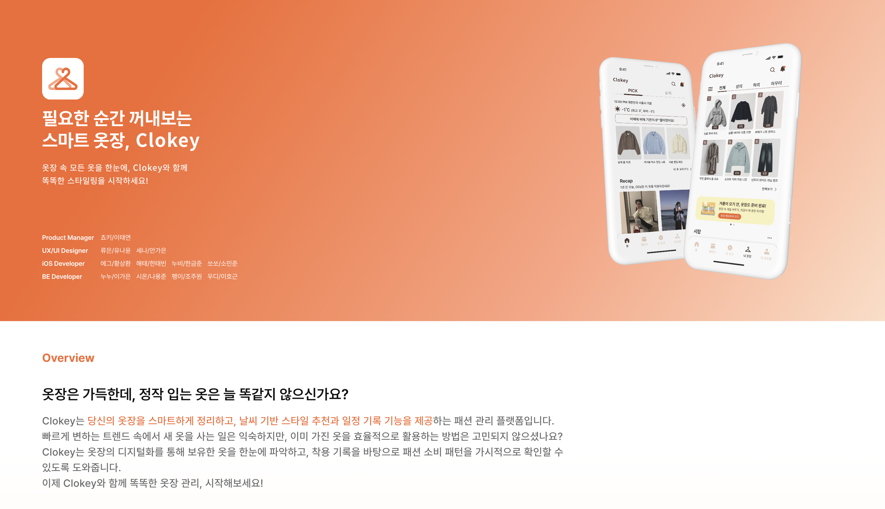

## 👗 Clokey: 스마트한 옷장 관리 서비스 (1.0 Legacy)

  

<h3 align="center">👕 당신만을 위한 <strong>스마트한 옷장 관리 서비스, Clokey</strong> 입니다.</h3>

  나의 옷장을 등록해서 관리하고 <strong>남들과 마음껏 공유</strong>해보세요!

  - 2025년 5월부터 iOS 앱스토어에서 서비스 중입니다! 
  - (리팩토링 완료 시점에 맞춰) <strong>새로워진 Clokey 2.0</strong>을 만나보세요!

  🔗 <a href="https://github.com/your-repo/clokey-v2">Clokey 2.0 Repository</a> 
  📲 <a href="https://apps.apple.com/app/id000000000">앱 스토어에서 Clokey 만나보기</a>

 
<h3 align="center">🧑‍💻 <strong>Clokey Backend Team</strong></h3>

  

    <a href="https://github.com/yongjun0511" target="_blank">
       
      
    </a>
  

  

    <a href="https://github.com/Ssamssamukja" target="_blank">
       
      
    </a>
  

  

    <a href="https://github.com/2ghrms" target="_blank">
       
      
    </a>
  

  

    <a href="https://github.com/juuuuone" target="_blank">
       
      
    </a>
  

 

 
<h2 align="center" style="font-size: 24px; margin-top: 0;">🎞️ Introducing Clokey</h2>

<!-- 첫 줄 -->

  

    

      <h3 style="font-size: 18px; margin: 0;">🏠 홈화면</h3>
    

    
    

      

        <strong>1. PICK</strong> 
        - 날씨별 옷장 추천 
        - 친구 Recap 확인  
        <strong>2. 소식</strong> 
        - 해시태그 기반 소식 
        - 실시간 인기 계정
      

    

  

  

    

      <h3 style="font-size: 18px; margin: 0;">📅 캘린더</h3>
    

    
    

      

        <strong>기록 확인</strong> 
        - 월별 정리  
        <strong>OOTD 기록</strong> 
        - 옷장 기반 코디 작성
      

    

  

  

    

      <h3 style="font-size: 18px; margin: 0;">➕ 옷 추가</h3>
    

    
    

      

        <strong>AI 옷 분류</strong> 
        - 두께감, 온도 설정 
        - 브랜드/상품 정보 등록
      

    

  

  

<!-- 둘째 줄 -->

  

    

      <h3 style="font-size: 18px; margin: 0;">👕 내 옷장</h3>
    

    
    

      

        내 옷장 등록/조회 
        카테고리별 정렬 지원
      

    

  

  

    

      <h3 style="font-size: 18px; margin: 0;">👤 내 프로필</h3>
    

    
    

      

        나만의 프로필을 
        자유롭게 설정하세요
      

    

  

  

    

      <h3 style="font-size: 18px; margin: 0;">🔍 검색 기능</h3>
    

    
    

      

        해시태그, 친구 닉네임 
        기반 검색 가능
      

    

  

# 여기에 아키텍쳐 사진 추가 -> 다시 만들고

# 여기에 기술 스택 들어갈거임

# ERD 정렬 후에 넣을까함.
